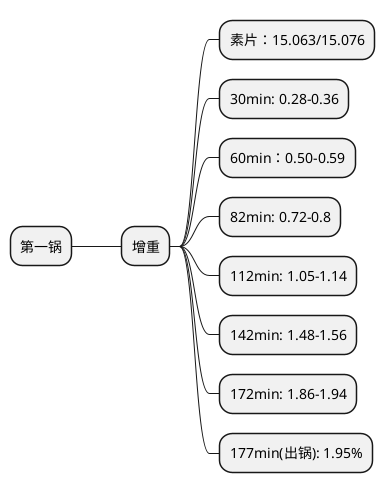

1. 匹维32412015-2
- 包衣过程温度不稳，饭后一小时内排风一度降到20℃以下造成锅壁有黏片，停机处理提高进风温度
- 本锅包前片芯也反馈较差

> 防水结果：随机抽取两把同时测，一把3个，另一把6个, 后续关注QC结果

2. ATF 32501015
- 配液： 3.75包衣粉+33.75纯化水配置10%固含量包衣液
- 另取出1.5kg包衣粉用于单锅包衣

第一锅：

```puml
@startmindmap

* 第一锅
** 增重
*** 素片：15.063/15.076
*** 30min: 0.28-0.36
*** 60min：0.50-0.59
*** 82min: 0.72-0.8
*** 112min: 1.05-1.14
*** 142min: 1.48-1.56
*** 172min: 1.86-1.94
*** 177min(出锅): 1.95%
@endmindmap
```